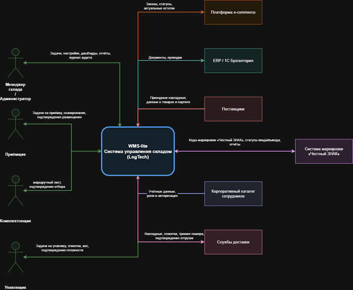

# WMS-lite: Система управления складом для e-commerce

---

**Версия документа:** 1.0  
**Дата:** 20.05.2026  

---

## 📖 Оглавление

1. [Контекст и границы](#1-контекст-и-границы)  
   1.1 [Описание системы](#11-описание-системы)  
   1.2 [Границы системы](#12-границы-системы)  
   1.3 [Внешние сущности и потоки данных](#13-внешние-сущности-и-потоки-данных)  
   1.4 [Внешние системы](#14-внешние-системы)  
   1.5 [Ключевые ограничения и допущения](#15-ключевые-ограничения-и-допущения)  
2. [Концепция функционирования (ConOps)](#2-концепция-функционирования-conops)  
   2.1 [Участники](#21-участники)  
   2.2 [Системные элементы](#22-системные-элементы)  
   2.3 [Сценарии использования](#23-сценарии-использования)  
   - 2.3.1 [Сценарий 1: Приёмка товаров от поставщика](#231-сценарий-1-приёмка-товаров-от-поставщика)  
   - 2.3.2 [Сценарий 2: Комплектация и упаковка клиентского заказа](#232-сценарий-2-комплектация-и-упаковка-клиентского-заказа)  
   - 2.3.3 [Сценарий 3: Отгрузка и передача заказа в службу доставки](#233-сценарий-3-отгрузка-и-передача-заказа-в-службу-доставки)  
   - 2.3.4 [Сценарий 4: Инвентаризация без остановки склада](#234-сценарий-4-инвентаризация-без-остановки-склада)  
   - 2.3.5 [Сценарий 5: Обработка возвратов и брака](#235-сценарий-5-обработка-возвратов-и-брака)  
3. [Требования](#3-требования)  
   3.1 [Stakeholder requirements](#31-stakeholder-requirements)  
   3.2 [System requirements](#32-system-requirements)  
   3.3 [Нефункциональные требования (NFR)](#33-нефункциональные-требования-nfr)  
4. [Архитектура](#4-архитектура)  
   4.1 [Декомпозиция на компоненты](#41-декомпозиция-на-компоненты)  
   4.2 [Ключевые архитектурные решения](#42-ключевые-архитектурные-решения)  
5. [Интерфейсы (ICD-lite)](#5-интерфейсы-icd-lite)  
   5.1 [Внешние интерфейсы](#51-внешние-интерфейсы)  
   5.2 [Внутренние интерфейсы](#52-внутренние-интерфейсы)  
   5.3 [Основные форматы данных](#53-основные-форматы-данных)  
   5.4 [Формальные API‑контракты](#54-формальные-api-контракты)  
6. [Риски](#6-риски)  
   6.1 [Шкала оценки рисков](#61-шкала-оценки-рисков)  
   6.2 [Реестр рисков](#62-реестр-рисков)  
7. [Верификация и валидация (V&V)](#7-верификация-и-валидация-vv)  
   7.1 [Матрица трассируемости](#71-матрица-трассируемости)  
   7.2 [Тест-кейсы](#72-тест-кейсы)  

---

## 1. Контекст и границы

### 1.1 Описание системы

**Название:** Система управления складом для e-commerce (WMS-lite)  

**Назначение:** Лёгкая система класса WMS, предназначенная для автоматизации складских процессов интернет-магазина. Обеспечивает приёмку товаров, размещение, обработку заказов (комплектация, упаковка, отгрузка), управление остатками в реальном времени и интеграцию с платформой e-commerce.

WMS-lite заменяет Excel-таблицы, бумажные журналы и разрозненные инструменты единой системой с мобильными терминалами сбора данных (ТСД), штрих-код/QR-сканированием и автоматической синхронизацией остатков.

**Типы обрабатываемых процессов:**
-	Приёмка и размещение товаров от поставщиков
-	Комплектация и упаковка клиентских заказов
-	Отгрузка и формирование документов для служб доставки
-	Инвентаризация, пересчёт и корректировка остатков
-	Обработка возвратов и брака
-	Управление адресным хранением (ячейки, зоны, стеллажи)

**Цель системы (миссия):** обеспечить 99 %+ точность остатков, скорость обработки заказов менее 30 минут и полную трассировку каждой единицы товара, чтобы:
-	Остатки мгновенно отражались на сайте e-commerce
-	Складской персонал работал только через мобильные приложения и ТСД.
-	Система работала в offline-режиме с последующей синхронизацией.
-	Минимизировались ошибки комплектации и упаковки.
-	Была полная история всех операций для аудита и аналитики.

### 1.2 Границы системы

**В границы WMS-lite входит:**  
-	Учёт товаров, серийных номеров, сроков годности и партий
-	Адресное хранение и динамическое размещение
-	Генерация и выполнение задач бизнес-процессов
-	Сканирование штрих-кодов / QR / RFID
-	Синхронизация остатков и заказов в реальном времени
-	Формирование отгрузочных документов и этикеток
-	Инвентаризация и корректировки
-	Отчёты по складу и аналитика
-	Мобильный интерфейс для складского персонала
	
**В границы WMS-lite (внешние системы) НЕ входит:** 
-	Фронтенд и корзина e-commerce
-	Бухгалтерский и финансовый учёт
-	CRM и база данных клиентов
-	Управление поставщиками и закупками (полностью)
-	Физическая доставка и трекинг посылок
-	Хранение учётных записей сотрудников (корпоративный каталог)
-	Печатающее оборудование и ТСД (только интеграция)

### 1.3 Внешние сущности и потоки данных

| Внешняя сущность       | Действие                                             | Потоки данных (что передаётся)                           |
|------------------------|------------------------------------------------------|----------------------------------------------------------|
| Менеджер склада        | Создаёт/корректирует задачи, настройки, отчёты       | Задачи, настройки склада, статусы, уведомления, отчёты   |
| Приёмщик               | Выполняет приёмку, сканирует, размещает              | Задачи на приёмку, список товаров, подтверждения         |
| Комплектовщик          | Получает задачи на отбор, сканирует                  | Маршрутные листы, подтверждения отбора                   |
| Упаковщик              | Упаковывает, взвешивает, печатает этикетки           | Задачи на упаковку, этикетки, вес, подтверждения         |
| Администратор          | Настраивает справочники, роли, интеграции, аудит     | Настройки системы, журнал аудита, статус интеграций      |

Контекстная диаграмма

### 1.4 Внешние системы
| Система                    | Направление обмена                                    | Данные                                                      |
|----------------------------|-------------------------------------------------------|-------------------------------------------------------------|
| Платформа e-commerce       | Передаёт заказы, получает остатки и статусы           | Заказы, статусы заказов, остатки                            |
| Службы доставки            | Получают документы, отправляют трекинг-номера         | Накладные, этикетки, трекинг-номера, подтверждения          |
| ERP / 1С Бухгалтерия       | Обмен финансовыми документами                         | Приходные/расходные документы, проводки                     |
| Система поставщиков        | Передаёт данные о приходных партиях                   | Приходные накладные, данные о товарах и партиях             |
| Корпоративный каталог      | Предоставляет учётные записи и роли                   | Учётные данные и роли сотрудников                           |
| Система «Честный ЗНАК»     | Передаёт коды маркировки, статусы ввода/вывода        | Коды Data Matrix, статусы, отчёты                           |

### 1.5 Ключевые ограничения и допущения

**Ограничения:**  
- WMS-lite не является ERP – не ведёт бухгалтерский учёт  
- Не управляет физическим оборудованием склада (роботы, конвейеры)  
- Не хранит персональные данные клиентов – только обезличенные заказы  
- Не отвечает за физическую доставку  
- Работает по модели «lite» (нет сложных 3PL-функций)  

**Допущения:**  
- Платформа e-commerce предоставляет стабильный API  
- Склад оснащён Wi-Fi и мобильными ТСТ со сканерами  
- Корпоративный каталог содержит актуальные учётные записи  
- Службы доставки поддерживают электронный обмен накладными  

---

## 2. Границы Sol

### 2.1 Концепция функционирования (ConOps)

**Система:** Система управления складом для e-commerce (WMS-lite / LogTech) Версия документа: 1.0 Дата: 07.04.2026
Документ описывает, как именно работает WMS-lite в реальных условиях эксплуатации: кто участвует, какие модули задействованы, как протекают ключевые процессы в штатном режиме, при сбоях и в нештатных ситуациях.

### 2.2 Участники

#### Внутренние участники:
- **Менеджер склада / Администратор** – создание задач, настройка зон, дашборды, отчёты, управление интеграциями.  
- **Приёмщик** – приёмка, сканирование, размещение товара.  
- **Комплектовщик** – отбор заказов по маршрутным листам.  
- **Упаковщик** – упаковка, взвешивание, печать этикеток, подготовка к отгрузке.  
- **Складской персонал** – все роли работают через ТСТ с авторизацией.

#### Внешние участники (через системы):
-  **Платформа e-commerce**
-  **Службы доставки**
-  **Поставщики**
-  **ERP / 1С Бухгалтерия**
-  **Корпоративный каталог сотрудников**
-  **Система маркировки «Честный ЗНАК»**

### 2.3. Системные элементы (типовая конфигурация)

######WMS-lite состоит из следующих ключевых модулей:
-  **Модуль приёмки и размещения** — обработка приходных документов, сканирование, размещение по ячейкам (в том числе без распоряжения).
-  **Модуль адресного хранения** — управление зонами, стеллажами, ячейками, динамическое размещение, учёт по партиям, характеристикам и срокам годности (FEFO).
-  **Модуль комплектации и упаковки** — генерация маршрутных листов, задач на отбор и упаковку, сканирование, взвешивание.
-  **Модуль отгрузки** — формирование накладных, этикеток, передача документов службам доставки.
-  **Модуль инвентаризации** — быстрый пересчёт без остановки работы склада, мгновенная синхронизация с 1С.
-  **Модуль работы с маркировкой «Честный ЗНАК»** — распознавание, фиксация и передача кодов маркировки, статусы ввода/вывода из оборота.
-  **Мобильный интерфейс + интеграция с ТСД** — Android/iOS-приложение для складского персонала, работа в offline-режиме с последующей синхронизацией.
-  **Журнал аудита и трассировка** — полная история всех операций с указанием исполнителя (авторизация по ролям).
-  **Интеграционный шлюз** — двунаправленная синхронизация с e-commerce, ERP/1С, службами доставки и системой «Честный ЗНАК».

### 2.4. Сценарии использования

#### 2.4.1 Сценарий №1: Приёмка товаров от поставщика (по распоряжению)
**Цель:** Принять партию товаров, проверить, разместить по ячейкам и мгновенно обновить остатки на сайте e-commerce.

**Предусловие:**
-  Получена приходная накладная из 1С или от поставщика.
-  Менеджер склада создал задачу на приёмку.
-  Приёмщик авторизован в системе через ТСД.
  
**Сценарий:**

 1. Приёмщик получает задачу на ТСД.
 2. Сканирует штрих-код приходной накладной.
 3. Сканирует каждый товар (включая коды «Честный ЗНАК»).
 4. Система проверяет соответствие количества и характеристик.
 5. Приёмщик размещает товар в предложенную ячейку (адресное хранение).
 6. Система фиксирует размещение и отправляет данные в ERP/1С и e-commerce.
 7. Приходная партия появляется в системе с актуальными остатками.

**Постусловие:** Товар размещён, остатки обновлены в реальном времени, вся операция зафиксирована в журнале аудита.

**Исключения:**
-  Несоответствие количества / брак — система предлагает создать акт расхождения.
-  Код «Честный ЗНАК» не читается — переход в ручной режим с фотофиксацией.
-  Нет связи с 1С — операция сохраняется локально и синхронизируется позже.

**Альтернативный сценарий:**
-  Offline-режим ТСД: все данные сохраняются локально до восстановления связи.
-  Частичная приёмка: система позволяет завершить операцию по уже отсканированным товарам.

